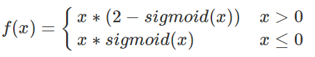

# E-swish: Adjusting Activations to Different Network Depths
This repository will contain the code for reproducibility of the experiments of [this paper](https://arxiv.org/abs/1801.07145v1)

Uploading soon.

## Formula

## Abstract

	Activation functions have a notorious impact on neural networks on both training and testing the models against the desired problem. Currently, the most used activation function is the Rectified Linear Unit (ReLU). This paper introduces a new and novel activation function, closely related with the new activation <i><b>Swish=x∗sigmoid(x)<b></i>Swish=x∗sigmoid(x)<b></i> (Ramachandran et al., 2017) which generalizes it. We call the new activation <i><b>E−swish=βx∗sigmoid(x). 
	We show that E-swish outperforms many other well-known activations including both ReLU and Swish. For example, using E-swish provided 1.5% and 4.6% accuracy improvements on Cifar10 and Cifar100 respectively for the WRN 10-2 when compared to ReLU and 0.35% and 0.6% respectively when compared to Swish. The code to reproduce all our experiments can be found at https://github.com/EricAlcaide/E-swish

## Results

### CIFAR10

* **WRN 10-2**

| Activations         		| % Accuracy (median of 3 runs) |
| -------------    			| -------------:|
| Swish            			| 89.98         |
| Relu             			| 91.52         |
| **E-swish (beta =1.375)** | **91.89**     |

## Contact

* **Email:** ericalcaide1@gmail.com
* **Twitter:** https://twitter.com/eric_alcaide